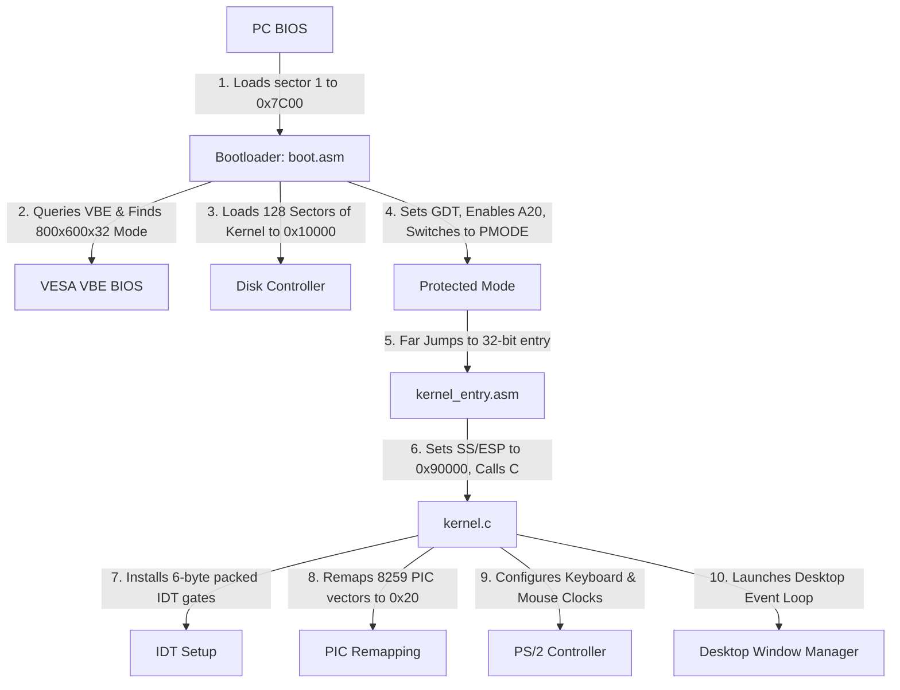

# 🌌 QuantumOS

> **Booting a custom 32-bit x86 graphical operating system directly from a floppy disk image!**  
> Written in pure Assembly and freestanding C. Featuring a dynamic VESA graphics engine, full hardware interrupts, custom PS/2 mouse and keyboard drivers, an overlapping desktop window manager, and an in-memory Virtual File System (VFS) with script execution!

---

## 🚀 Welcome to QuantumOS!
Hey there! Welcome to **QuantumOS**. This is a project born out of a desire to understand what happens under the hood when a computer turns on. I wanted to build an operating system from scratch—no Linux kernels, no Windows sub-layers, just boot-to-bare-metal code. 

To make this work, I had to dive deep into x86 hardware specifications, the PC architecture, and the BIOS. Below is a comprehensive, "PhD-level" breakdown of the entire architecture, written so that anyone can grasp the concepts and see how these low-level pieces fit together!

---

## 📐 Architectural Specification

The boot sequence and run-time execution flow follow this pipeline:



---

### 💾 1. The 16-bit Bootloader (`src/boot/boot.asm`)
When the PC powers on, the BIOS runs a Power-On Self-Test (POST), searches for bootable media, and loads the first 512-byte sector (the boot sector) into physical memory at address `0x7C00`.

#### **Dynamic VESA BIOS Extensions (VBE) Initialization**
Instead of hardcoding a VESA mode number (which varies by graphics card), the bootloader dynamically queries the VBE controller:
1. **Get Controller Info (`AX=4F00h`)**: We pass a 512-byte buffer at `0x8000`. The BIOS returns a `VbeInfoBlock` containing a far pointer (`VideoModePtr`) to the list of supported modes.
2. **Scan Mode List**: We iterate through the modes in memory. For each mode, we call **VBE Function 01h (`AX=4F01h`)** with `ES:DI` pointing to a `ModeInfoBlock` at `0x9000`.
3. **Filter Parameters**: We check offset `0x12` (X resolution = 800), offset `0x14` (Y resolution = 600), and offset `0x19` (BitsPerPixel = 32).
4. **Set Mode (`AX=4F02h`)**: When the 32bpp mode is found, we set it. We OR the mode number with `0x4000` (setting bit 14) to request a **Linear Frame Buffer (LFB)** instead of bank-switching.
5. **Save Parameters**: We read the physical frame buffer pointer (`PhysBasePtr` at offset `0x28` of the `ModeInfoBlock`) and save it to a mailbox address (`0x7000`) for the C kernel.

#### **Disk Reading (CHS Loop)**
The bootloader loads the C kernel from the disk. We loop and read the disk **one sector at a time** using **BIOS INT 13h, AH=02h** for maximum reliability. The floppy geometry assumes 18 sectors per track and 2 heads. We dynamically increment the Sector, Head, and Cylinder registers in our read loop to copy 128 sectors (64KB) to address `0x10000`.

#### **The GDT and Protected Mode Switch**
To enter 32-bit Protected Mode, we must disable interrupts (`cli`), enable the **A20 Gate** (allowing the CPU to access memory beyond 1MB by writing to I/O port `0x92`), and load the **Global Descriptor Table (GDT)**.
The GDT defines three segments (Null, Code, and Data) with flat 4GB limits:
* **Code Segment**: Base `0x0`, Limit `0xFFFFF`, Access `0x9A` (execute/read, ring 0), Flags `0xCF` (32-bit mode, 4KB granularity).
* **Data Segment**: Base `0x0`, Limit `0xFFFFF`, Access `0x92` (read/write, ring 0), Flags `0xCF`.

We load the GDT using the `lgdt` instruction and set the Protection Enable (PE) bit in the `cr0` register. Finally, we execute a **far jump** (`jmp 0x08:pm_entry`) to flush the CPU's 16-bit prefetch queue and load the 32-bit Code Segment selector into `CS`.

---

### ⚙️ 2. The 32-bit Assembly Entry (`src/kernel/kernel_entry.asm`)
At `pm_entry`, we are running 32-bit code but segment registers (`DS`, `ES`, `FS`, `GS`, `SS`) are uninitialized. We set them to the GDT data selector (`0x10`) and point the stack pointer (`ESP`) to `0x90000` (giving us a safe stack space growing downwards).

#### **Floating Point Unit (FPU) Initialization**
We execute the `fninit` instruction. This initializes the x87 FPU, clearing any pending floating-point exceptions and preventing Device Not Available (`#NM`) exceptions when the CPU performs floating-point operations.

#### **Interrupt Wrappers & I/O Helpers**
Since C cannot directly execute instructions like `in`, `out`, `lidt`, or `iret`, the assembly file exposes global wrappers (`_inb`, `_outb`, `_lidt`, etc.). It also defines ISR stubs:
* When an interrupt fires, the CPU pushes registers.
* The stubs run `pusha` to preserve general-purpose registers.
* They call the C handlers (`_keyboard_handler`, `_mouse_handler`).
* They send the End of Interrupt (EOI) command `0x20` to the PIC.
* They call `popa` and execute `iret` (interrupt return).

---

### 🛡️ 3. PIC Remapping & IDT Setup (`src/kernel/kernel.c`)
By default, the IBM PC maps hardware interrupts (IRQs) to CPU interrupt vectors `0x08` to `0x0F`. However, the Intel CPU reserves vectors `0x00` to `0x1F` for internal exceptions (like Page Faults and GPFs). To prevent conflict, we remap the **8259 Programmable Interrupt Controller (PIC)**.

#### **PIC Remap Words**
We send Initialization Command Words (ICWs) to the PIC ports:
* Master PIC (ports `0x20`/`0x21`) and Slave PIC (ports `0xA0`/`0xA1`).
* Map Master IRQs `0-7` to interrupt vectors `0x20-0x27`.
* Map Slave IRQs `8-15` to interrupt vectors `0x28-0x2F`.
* Clear interrupt masks (`outb(0x21, 0x00)` and `outb(0xA1, 0x00)`) to enable all hardware lines.

#### **Interrupt Descriptor Table (IDT) Packing**
The IDT contains 256 gates. Each gate is an 8-byte structure pointing to an ISR.
To prevent the compiler from inserting alignment bytes, we declare the IDT pointers within a `#pragma pack(push, 1)` directive, forcing a strict 6-byte layout for `idt_ptr` (2 bytes limit, 4 bytes base). This ensures that `lidt` successfully registers the IDT at `0x0001a0a0` instead of reading padded garbage.

---

### 🖱️ 4. PS/2 Hardware Drivers (`src/kernel/kernel.c`)
The keyboard and mouse are managed by the Intel 8042 Keyboard Controller.

#### **PS/2 Controller Configuration**
To configure the devices, we query and write back the Controller Command Byte:
1. Send read command `0x20` to port `0x64`, and read the command byte from `0x60`.
2. Modify the command byte: **`status = (status | 3) & ~0x30;`**
   * **`| 3`**: Enable interrupts for Keyboard (IRQ 1) and Mouse (IRQ 12).
   * **`& ~0x30`**: Clear bits 4 and 5 to enable the clock lines for both Keyboard and Mouse.
3. Write back the byte using write command `0x60` to port `0x64`.

#### **PS/2 Mouse 3-Byte Packet State Machine**
The mouse sends data in packets of 3 bytes. We implement a state machine inside `mouse_handler`:
* **Resynchronization Guard**: The first byte of a packet (`mouse_cycle == 0`) **must** have bit 3 set (`data & 0x08`). If this bit is 0, we are out of alignment, and we discard the byte. This keeps the mouse coordinates from drifting.
* **Sign Extension**:
  * Byte 0: Flags (Bit 0 = Left Click, Bit 1 = Right Click, Bit 4 = X Sign, Bit 5 = Y Sign).
  * Byte 1: Delta X.
  * Byte 2: Delta Y.
  * If the X sign bit is set, we sign-extend the 8-bit delta to 32 bits (`dx |= 0xFFFFFF00`) to represent negative movement.
* **Boundary Clipping**: We add the deltas to `mouse_x` and `mouse_y` and clip them to the screen dimensions (`0` to `799` and `0` to `599`).

---

### 🖼️ 5. VESA VBE Graphics & Double Buffering (`src/kernel/kernel.c`)
Writing directly to the video card's frame buffer (`VBE_FB_PTR`) causes heavy flickering (tearing) during window dragging because the screen redraws while the memory is being written.

To solve this, we implement **Double Buffering**:
1. We allocate a **1.92 MB backbuffer** in RAM at physical address `0x200000` (2MB).
2. All drawing functions (fonts, shapes, desktop elements) write pixels directly to the backbuffer using:
   $$\text{Offset} = (y \times \text{Width}) + x$$
3. At the end of the frame, `swap_buffer()` performs a fast copy loop, flushing the contents of the backbuffer to the physical video framebuffer.

---

### 🗄️ 6. The Virtual Filesystem (VFS) & Scripting (`src/kernel/kernel.c`)
Since we do not have a hard drive controller driver, we implement an **in-memory Virtual Filesystem (VFS)**:
* We define a `VirtualFile` structure representing filename (16 bytes), content (512 bytes), size, and usage flag.
* We instantiate a global table of 8 files, pre-populated with files like `welcome.txt` and `script.txt`.
* **Escaped Newline Support**: When writing files via `write <file> <text>`, the write command scans for `\n` characters and converts them to actual newlines (`0x0A`) in memory, allowing multiline text editing.
* **Scripting Engine**: The `run <file>` command reads a text file line-by-line, parses the string, and executes each line as a recursive call to `run_shell_command()`.

---

## 🛠️ Build & Run Instructions

### **1. Prerequisites**
You need the following tools installed on your Windows host:
* [NASM](https://www.nasm.us/) (x86 Assembler)
* [MinGW-w64 GCC](https://www.mingw-w64.org/) (for C compilation)
* GNU Make (or `mingw32-make`)
* [QEMU](https://www.qemu.org/) (x86 Emulator)

### **2. Compilation**
Rebuild the floppy disk image from source:
```powershell
make clean
make all
```
This runs the compilation pipeline:
1. `nasm` compiles `boot.asm` into a 512-byte raw binary bootloader `boot.bin`.
2. `nasm` compiles `kernel_entry.asm` to COFF object file `kernel_entry.o`.
3. `gcc` compiles `kernel.c` with flags `-ffreestanding -O2 -m32 -fno-pic -fno-stack-protector -nostdlib` to `kernel.o`.
4. `ld` links `kernel_entry.o` and `kernel.o` using `link.ld` into `kernel.tmp` linked at address `0x10000`.
5. `objcopy` strips headers from `kernel.tmp` creating raw flat binary `kernel.bin`.
6. PowerShell concatenates `boot.bin` and `kernel.bin` and pads it to exactly `1,474,560` bytes (a 1.44MB floppy disk image `quantum_os.img`).

### **3. Run Emulator**
Launch the OS in QEMU:
```powershell
make run
```

---

## ⌨️ Desktop Interface & Shortcuts

### **Global Keyboard Shortcuts**
* **`Alt + S`**: Open / Focus the **Quantum Shell** terminal.
* **`Alt + L`**: Open / Focus the **LetterPad** text editor.
* **`Alt + I`**: Open / Focus the **System Info** window.
* **`Alt + C`**: Close the currently active window.
* **`Alt + B`**: Cycle through the background wallpaper gradients (Deep Purple, Ocean Blue, Wine Red, Slate Grey).
* **`Alt + R`**: Perform a hardware reboot (sends `0xFE` to port `0x64`).
* **`Alt + P`**: Shut down the system.

### **Integrated LetterPad Toolbar**
* **`[Save]`**: Click this button in the LetterPad toolbar to save the current text to `note.txt` in the Virtual Filesystem.
* **`[Load]`**: Click this button to restore the contents of `note.txt` back into the editor.
